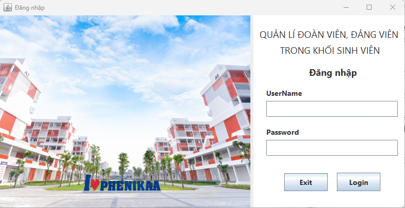
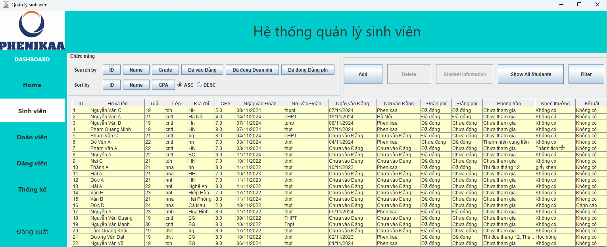
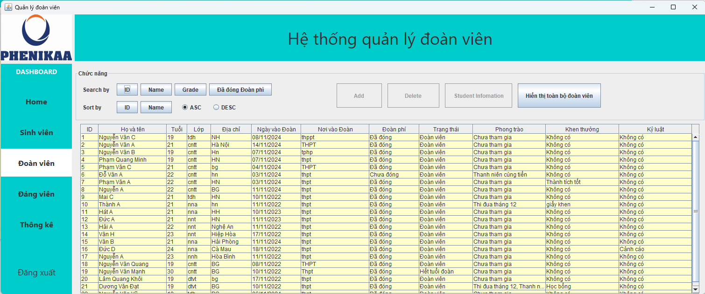
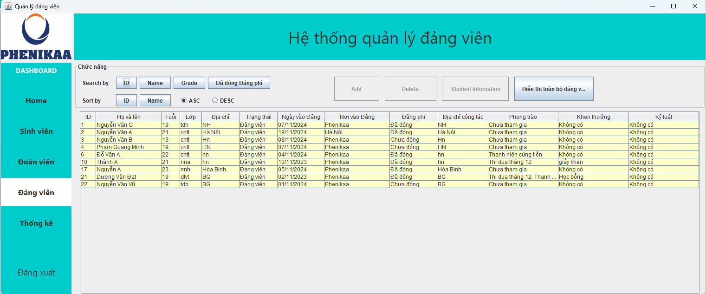
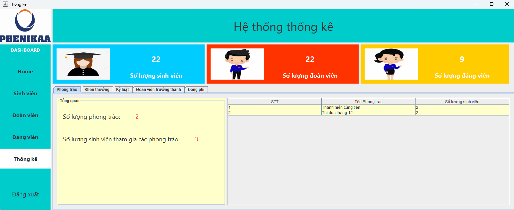
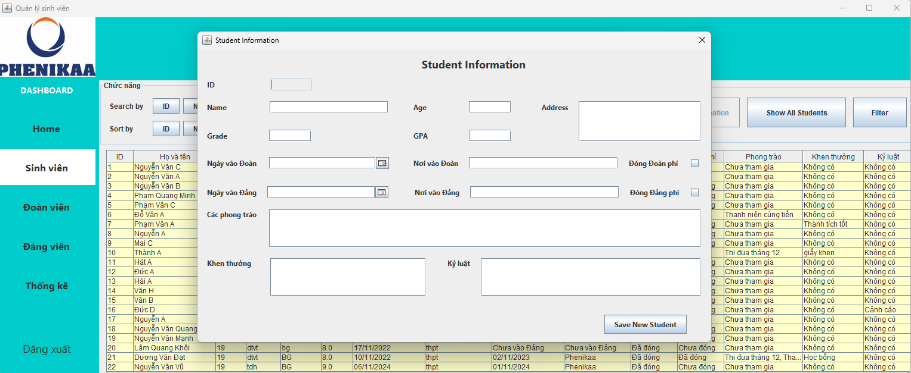
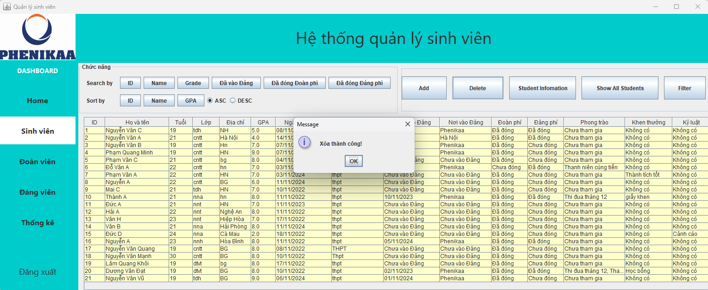
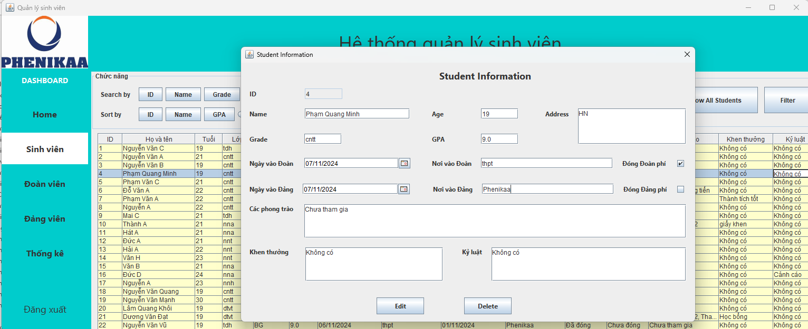
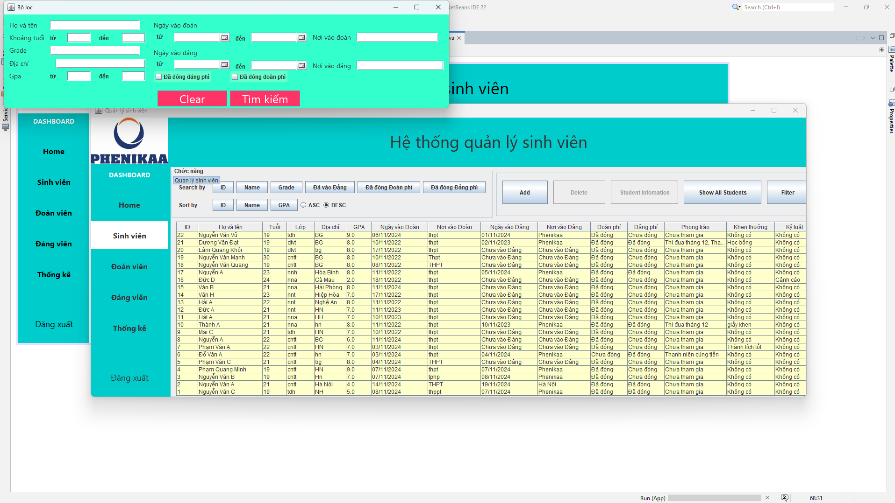

# QUẢN LÍ ĐOÀN VIÊN, ĐẢNG VIÊN TRONG KHỐI SINH VIÊN
Ứng dụng quản lý sinh viên được thiết kế để hỗ trợ các trường học và tổ chức trong việc quản lý và theo dõi thông tin Đoàn viên, Đảng viên trong khối sinh viên. Ứng dụng cung cấp các chức năng thêm, xóa, tìm kiếm, lọc và sắp xếp sinh viên theo các tiêu chí cụ thể.

## Hướng dẫn về chương trình:
1. Chạy chương trình
Từ mã nguồn: Chạy file App.java để khởi động ứng dụng.
Từ file JAR: Tìm và mở file qlsv-swing-1.0.0.jar trong thư mục ứng dụng (cần cài đặt Java trên máy tính).
2. Đăng nhập
### Username: admin
### Password: admin
Sau khi đăng nhập thành công, chương trình sẽ chuyển đến giao diện chính.

## Giao diện chính và các chức năng
3. Giao diện chính
Các lớp giao diện đều có thanh dashboard để chuyển qua các giao diện khác
### HomeView

### StudentView
Bảng thông tin sinh viên: Hiển thị thông tin chi tiết về các sinh viên là Đoàn viên, Đảng viên, gồm các cột:
ID, Họ tên, Lớp, Địa chỉ, Tuổi, GPA, Ngày vào Đoàn, Nơi vào Đoàn, Ngày vào Đảng, Nơi vào Đảng, Đoàn phí, Đảng phí, Phong trào tham gia, Khen thưởng, Kỷ luật.

### DoanVienView
Bảng thông tin Đoàn viên: Hiển thị thông tin chi tiết về các sinh viên là Đoàn viên, Đảng viên, gồm các cột:
ID, Họ tên, Lớp, Địa chỉ, Tuổi, Ngày vào Đoàn, Nơi vào Đoàn, Đoàn phí, Phong trào tham gia, Khen thưởng, Kỷ luật.

### DangVienView
Bảng thông tin Đoàn viên: Hiển thị thông tin chi tiết về các sinh viên là Đoàn viên, Đảng viên, gồm các cột:
ID, Họ tên, Lớp, Địa chỉ, Tuổi, Ngày vào Đảng, Nơi vào Đảng, Đảng phí, Phong trào tham gia, Khen thưởng, Kỷ luật.

### ThongkeView
Gồm nhiều các tab khác nhau trong tabbedPane

4. Các nút chức năng chính
Thao tác cơ bản:
Add (Thêm mới): Thêm sinh viên mới vào hệ thống. Màn hình nhập thông tin sẽ xuất hiện sau khi bấm nút. Nhập thông tin và chọn Save New Student để lưu.

Delete (Xóa): Xóa sinh viên khỏi danh sách. Chọn một sinh viên từ bảng và bấm nút Delete.

Student Information (Chi tiết sinh viên): Hiển thị thông tin chi tiết và cho phép chỉnh sửa. Chọn sinh viên trong bảng, bấm nút để mở cửa sổ thông tin chi tiết. Tại đây có thể chọn Edit để chỉnh sửa hoặc Delete để xóa sinh viên.

### Sắp xếp:
Sort By ID: Sắp xếp sinh viên theo ID.
Sort By Name: Sắp xếp sinh viên theo tên.
Sort By GPA: Sắp xếp sinh viên theo GPA.
Có thể chọn sắp xếp tăng dần hoặc giảm dần, có 2 nút ASC, DESC để lựa chọn cho việc này.
### Hiển thị tất cả:
Show All Students: Hiển thị toàn bộ danh sách sinh viên được lưu trong hệ thống và sắp xếp theo ID.
### Tìm kiếm:
Search By ID: Tìm kiếm sinh viên theo ID (hiển thị hộp thoại nhập ID, sau đó tìm và hiển thị kết quả).
Search By Name: Tìm kiếm sinh viên theo tên (hiển thị hộp thoại nhập tên, có thể trả về nhiều sinh viên có cùng tên).
Search By Grade: Tìm kiếm sinh viên theo lớp (hiển thị hộp thoại nhập lớp).
Đã vào Đảng: Hiển thị danh sách sinh viên đã vào Đảng.
Đã đóng Đoàn phí: Hiển thị danh sách sinh viên đã đóng Đoàn phí.
Đã đóng Đảng phí: Hiển thị danh sách sinh viên đã đóng Đảng phí.

### Lọc:
Filter: Lọc sinh viên theo các tiêu chí:

5. Lưu ý
### Sau khi sử dụng các chức năng tìm kiếm hoặc lọc, có thể tiếp tục sử dụng các nút Sort để sắp xếp danh sách đã tìm/lọc

### Lưu ý về độ trễ trong phản hồi nút bấm:
Trong một số trường hợp, phản hồi của các nút bấm có thể hơi chậm, đặc biệt là khi đang xử lý các thao tác lớn hoặc tải nhiều dữ liệu. Nếu không thấy phản hồi ngay lập tức, người dùng có thể đợi một chút hoặc nhấn lại nút sau vài giây.
